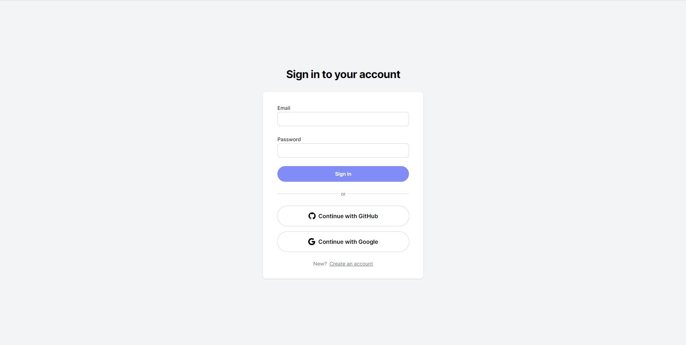

Techstack: Typescript, Tailwind, Next.js, Mongodb, Prisma, NextAuth

Create Nextjs13 applications with user authentication without having to configure it yourself. Alpaca saves you hours of development time with built-in and customizable user authentication. Use it straight out of the box with Goggle and Github or customize it to your needs. 

Alpaca handles the authentication, so you can build that next amazing project in less time.

Here are somethings to keep in mind when using Alpaca:

1.  When creating your MongoDB database, set the IP address to "0.0.0.0/0".
    If you do not do this, you will run into issues during production.

2.  When creating your Github client and secret token in your Github developer settings,
    be sure to increase the scope of the tokens to have access to the user's email.
    By default, if the user's email is private, the "email" attribute will be null.

3.  Keep thinking, keep building, and keep trying